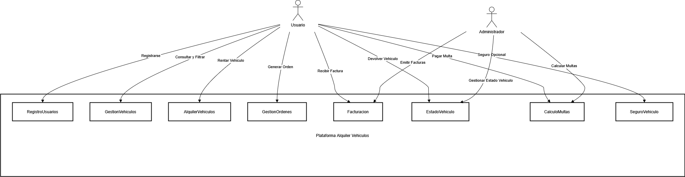
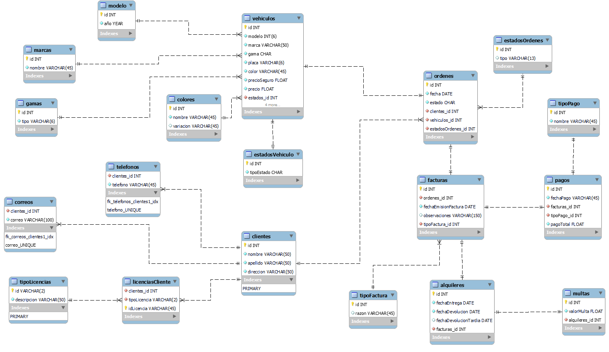
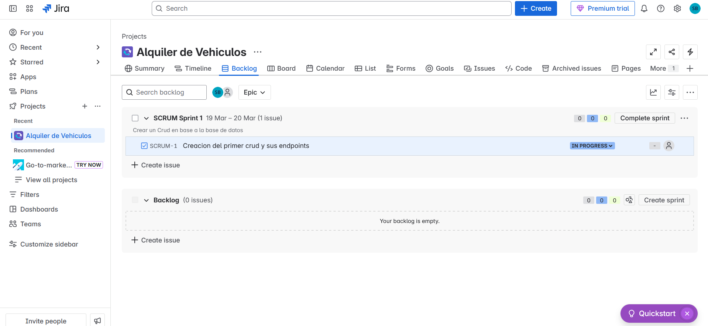

# ALQUILER DE AUTOS


## MODELO CONCEPTUAL

El usuario podra realizar el alquiler de un vehiculo al llegar a las  instalaciones, se podra registrar con anteriorirdad atraves de n  formulario para estar en nuestra base de datos y agilizar el proceso de  alquiler, podra filtrar los autos segun su gama, este mismo usuario  podra rentar la cantidad de vehiculos que desee, hay vehiculos que  poseen un seguro y este solo sera para vehiculos de gama media y alta,  si el auto se renta a un amigo del dueño se puede omitir el cobro de  este seguro, los alquileres se realizaran por dias, y si el usuario se  pasa de los dias sera multado, el cliente al elegir el auto genera una  orden la cual pasara a preparacion y sera entregado al cliente, esta  orden tendra 2 estados, pendiente y completada, completada la orden se  emitira una factura para que el usuario realice el pago del alquiler y  pueda disfrutar de su auto.

Los valores de las multas seran definidos atraves de consultas, segun el porcentaje que el dueño desee.

Las multas se referenciaran junto con la factura inicial de alquiler.

Tambien se debe manejar el estado fisico del vehiculo en  un texto descriptivo de salida y un texto descriptivo de vuelta al lugar de rentado, llego el caso que hayan daños se emitira tambien una  factura de cobro de loa arreglos del vehiculo si este es de gama baja,  ya que no paga seguro.


# Justificación y Pertinencia de la Temática

El presente proyecto busca optimizar el proceso de alquiler de vehículos, permitiendo a los clientes registrar su información previamente para agilizar la gestión de reservas. Además, se implementará un sistema de filtrado por gamas de vehículos, asegurando una experiencia personalizada para cada usuario. La automatización del proceso de generación de órdenes, gestión de estados de alquiler, y emisión de facturas y multas contribuirá significativamente a la eficiencia del servicio, brindando a los clientes una experiencia fluida y confiable.

# Mundo del Problema

Actualmente, muchas empresas de alquiler de vehículos manejan procesos manuales que generan demoras en la atención al cliente. El registro de usuarios, la selección de vehículos y la generación de órdenes suelen realizarse de forma presencial y sin un sistema centralizado. Esto provoca retrasos, errores en la facturación y dificultades en la administración de multas y seguros. Con la implementación de una plataforma digital, se busca optimizar estos procesos mediante la automatización y digitalización del flujo de trabajo.

# Tecnologías Utilizadas

- **Spring Boot** - Framework para el backend.
- **Spring Data JPA** - Manejo de persistencia con Hibernate.
- **MySQL** - Base de datos relacional.
- **Swagger (Springdoc OpenAPI)** - Documentación interactiva de la API.
- **Postman** - Herramienta para probar la API.
- **Typora** - Para el desarrollo de la documentación general.  


# Requerimientos Funcionales

1. **Registro de Usuarios**:
   - Los usuarios podrán registrarse a través de un formulario para agilizar el proceso de alquiler.
2. **Gestión de Vehículos**:
   - Los usuarios podrán consultar y filtrar los vehículos según su gama (baja, media, alta).
   - Los vehículos deben estar asociados a un estado físico inicial (salida) y un estado físico final (retorno).
3. **Alquiler de Vehículos**:
   - Los usuarios podrán rentar la cantidad de vehículos que deseen.
   - El sistema calculará automáticamente el costo del alquiler y, si corresponde, el costo del seguro.
   - En el caso de clientes relacionados (amigos del dueño), el seguro podrá ser exonerado.
   - Se registrará la duración del alquiler en días, y se calcularán multas en caso de retrasos.
4. **Gestión de Órdenes de Alquiler**:
   - Cada vez que un usuario selecciona un vehículo, se generará una orden con estado "pendiente" o "completada".
   - Una vez completada, se emitirá una factura con el monto a pagar.
5. **Cálculo de Multas**:
   - Las multas se calcularán según un porcentaje definido por el dueño.
   - Las multas serán incluidas en la factura del alquiler.
6. **Gestión de Daños a Vehículos**:
   - Si un vehículo de gama baja sufre daños, se emitirá una factura adicional para cubrir los costos de reparación.
7. **Facturación**:
   - El sistema generará facturas para el alquiler, incluyendo costos de seguro, multas y reparaciones, según corresponda.

# Requerimientos No Funcionales

1. La plataforma debe ser accesible desde cualquier dispositivo con conexión a internet.
2. Implementación de un diseño responsivo y amigable.
3. Seguridad en la autenticación de usuarios.
4. Respuesta rápida en la generación de órdenes y facturas.
5. Mantenimiento y actualización de la base de datos en tiempo real.
6. Uso de una base de datos relacional para almacenamiento seguro.

# Historias de Usuario

1. **Registro de Usuario:** Como cliente, quiero registrarme en la plataforma para agilizar mis futuros alquileres.
2. **Filtrado de Vehículos:** Como cliente, quiero poder filtrar los vehículos según su gama para encontrar el que mejor se ajuste a mis necesidades.
3. **Generación de Orden:** Como cliente, quiero generar una orden de alquiler para reservar mi vehículo deseado.
4. **Seguro Opcional:** Como cliente, quiero saber si el vehículo tiene seguro y, en caso de ser amigo del dueño, poder omitir el cobro del mismo.
5. **Multas por Retraso:** Como cliente, quiero recibir una notificación y una factura por los días de retraso en la devolución del vehículo.
6. **Estado del Vehículo:** Como administrador, quiero registrar el estado del vehículo al inicio y al final del alquiler para evaluar posibles daños.
7. **Emisión de Factura:** Como cliente, quiero recibir una factura detallada de mi alquiler para conocer el monto a pagar.

## DESCRIPCION DE LAS TABLAS

## Tabla estadosVehiculo

- `id` (INT): Identificador único.
- `tipoEstado` (CHAR, NOT NULL): Tipo de estado del vehículo.

## Tabla marcas

- `id` (INT): Identificador único.
- `nombre` (VARCHAR(45), NOT NULL): Nombre de la marca.

## Tabla gamas

- `id` (INT): Identificador único.
- `tipo` (VARCHAR(6), NOT NULL): Tipo de gama.

## Tabla colores

- `id` (INT): Identificador único.
- `nombre` (VARCHAR(45), NOT NULL): Nombre del color.
- `variacion` (VARCHAR(45), NULL): Variación del color (opcional).

## Tabla modelo

- `id` (INT): Identificador único.
- `anio` (YEAR, NOT NULL): Año del modelo.

## Tabla tipoLicencias

- `id` (VARCHAR(2)): Identificador único.
- `descripcion` (VARCHAR(50), NOT NULL): Descripción del tipo de licencia.

## Tabla clientes

- `id` (INT): Identificador único.
- `nombre` (VARCHAR(50), NOT NULL): Nombre del cliente.
- `apellido` (VARCHAR(50), NOT NULL): Apellido del cliente.
- `direccion` (VARCHAR(50), NOT NULL): Dirección del cliente.

## Tabla telefonos

- `clientes_id` (INT, NOT NULL): ID del cliente relacionado.
- `telefono` (VARCHAR(45), NOT NULL): Número de teléfono.

## Tabla correos

- `clientes_id` (INT, NOT NULL): ID del cliente relacionado.
- `correo` (VARCHAR(100), NOT NULL): Dirección de correo electrónico.

## Tabla licenciasCliente

- `clientes_id` (INT, NOT NULL): ID del cliente relacionado.
- `tipoLicencia` (VARCHAR(2), NOT NULL): Tipo de licencia.
- `idLicencia` (VARCHAR(45), NOT NULL): Identificador de la licencia.

## Tabla vehiculos

- `id` (INT): Identificador único.
- `modelo` (INT, NOT NULL): ID del modelo relacionado.
- `marca` (VARCHAR(50), NOT NULL): Marca del vehículo.
- `gama` (CHAR, NOT NULL): Gama del vehículo.
- `placa` (VARCHAR(6), NOT NULL): Número de placa.
- `color` (VARCHAR(45), NOT NULL): Color del vehículo.
- `precioSeguro` (FLOAT, NOT NULL): Precio del seguro.
- `precio` (FLOAT, NOT NULL): Precio del vehículo.
- `estados_id` (INT, NOT NULL): ID del estado del vehículo.
- `modelo_id` (INT, NOT NULL): ID del modelo relacionado.
- `marca_id` (INT, NOT NULL): ID de la marca relacionada.
- `gama_id` (INT, NOT NULL): ID de la gama relacionada.
- `colores_id` (INT, NOT NULL): ID del color relacionado.


## Tabla estadosOrdenes

- `id` (INT, NOT NULL): Identificador único.
- `tipo` (VARCHAR(13), NULL): Tipo de estado.

## Tabla ordenes

- `id` (INT): Identificador único.
- `fecha` (DATE, NOT NULL): Fecha de la orden.
- `estado` (CHAR, NOT NULL): Estado de la orden.
- `clientes_id` (INT, NOT NULL): ID del cliente asociado.
- `vehiculos_id` (INT, NOT NULL): ID del vehículo asociado.
- `estadosOrdenes_id` (INT, NOT NULL): ID del estado de la orden.

## Tabla tipoFactura

- `id` (INT, NOT NULL): Identificador único.
- `razon` (VARCHAR(45), NULL): Razón de la factura (opcional).

## Tabla facturas

- `id` (INT, NOT NULL): Identificador único.
- `ordenes_id` (INT, NOT NULL): ID de la orden asociada.
- `fechaEmisionFactura` (DATE, NOT NULL): Fecha de emisión de la factura.
- `observaciones` (VARCHAR(150), NULL): Observaciones sobre la factura (opcional).
- `tipoFactura_id` (INT, NOT NULL): ID del tipo de factura.

## Tabla tipoPago

- `id` (INT, NOT NULL): Identificador único.
- `nombre` (VARCHAR(45), NOT NULL): Nombre del tipo de pago.

## Tabla pagos

- `id` (INT, NOT NULL): Identificador único.
- `fechaPago` (VARCHAR(45), NOT NULL): Fecha del pago.
- `facturas_id` (INT, NOT NULL): ID de la factura asociada.
- `tipoPago_id` (INT, NOT NULL): ID del tipo de pago.
- `pagoTotal` (FLOAT, NOT NULL): Total del pago.

## Tabla alquileres

- `id` (INT, NOT NULL, AUTO_INCREMENT): Identificador único.
- `fechaEntrega` (DATE, NOT NULL): Fecha de entrega del vehículo.
- `fechaDevolucion` (DATE, NOT NULL): Fecha de devolución del vehículo.
- `fechaDevolucionTardia` (DATE, NULL): Fecha de devolución tardía del vehículo (opcional).
- `facturas_id` (INT, NOT NULL): ID de la factura asociada.

## Tabla multas

- `id` (INT, NOT NULL, AUTO_INCREMENT): Identificador único.
- `valorMulta` (FLOAT, NOT NULL): Valor de la multa.
- `alquileres_id` (INT, NOT NULL): ID del alquiler asociado.


## Diagrama de Casos de Uso




## Diagrama de Clases


## Modelo de Base de Datos



## Cuenta de Jira

Se muestra la evidencia de la creación de la cuenta de Jira con la cual se manejara la metodología scrum en el desarrollo del sistema.

# Documentación de la API con Swagger

Para acceder a la documentación interactiva de la API, inicia el servidor de Spring Boot y abre el siguiente enlace en tu navegador:

http://localhost:8080/swagger-ui/index.html

Esto te permitirá probar los endpoints directamente desde la interfaz de Swagger.

## Endpoints

### Tabla Cliente

#### 1. Obtener todos los clientes

**GET** `/clientes`

#### 2. Obtener un cliente por ID

**GET** `/clientes/{id}`

#### 3. Crear un nuevo cliente

**POST** `/clientes`

**Ejemplo de Cuerpo:**

```
{

 "nombre": "Pedro ",

 "apellido": "Navaja 2.0",

 "identificacion": "1005282286"

}
```


#### 4. Actualizar un cliente existente

**PUT** `/clientes/{id}`

**Ejemplo de Cuerpo:**

**

```
{

 "nombre": "Pedro ",

 "apellido": "Navaja 2.0",

 "identificacion": "1005282286"

}
```


#### 5. Eliminar un cliente

**DELETE** `/clientes/{id}`

# Instalación y Uso

1. Clonar el repositorio.
2. Ejecutar la base de datos que se encuentra en Database.txt
3. Configurar la base de datos en `application.properties`.
4. Ejecutar el proyecto con Spring Boot.
5. Acceder a Swagger para probar la API.
